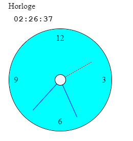

# Exercice sur les dates

## Utilisation de la classe Date
## Extraction des heures, minutes et des secondes
## Affichage de l'heure courante dans la page
## Mise à jour de l'heure courante dans la page
## Les choses se corsent

### Atelier créé par Nadjim KAABACHE
